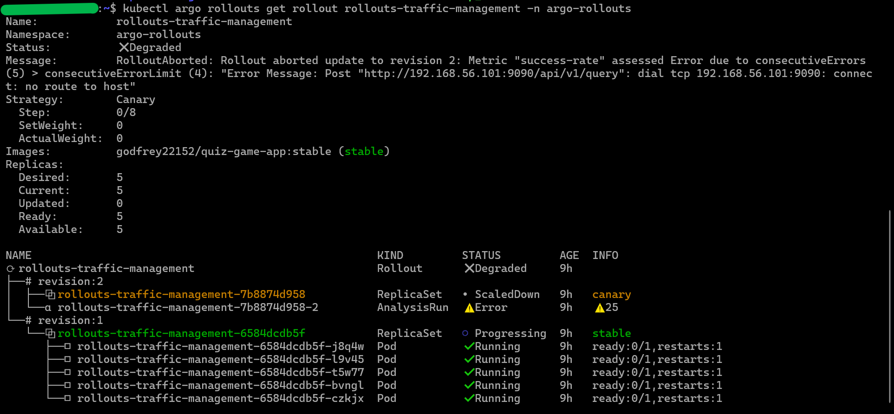
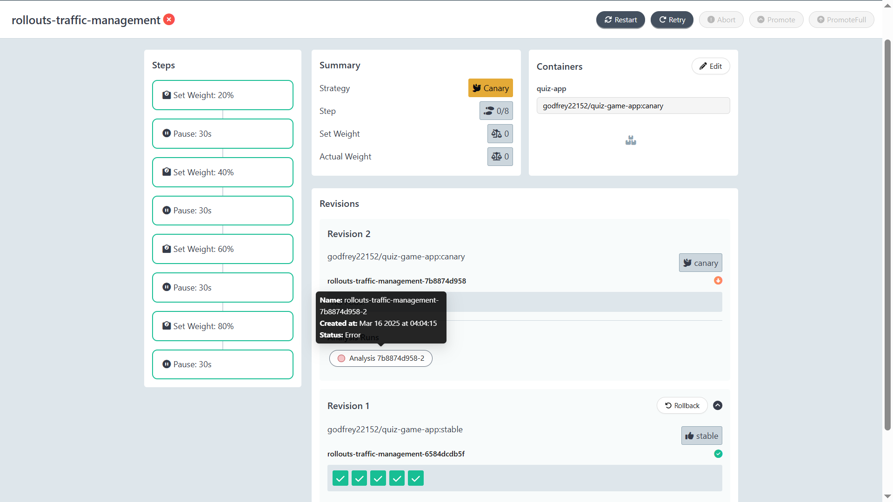

# **Canary Deployment with Argo Rollouts** 🎯🔬🔥

## **Table of Contents**
1. 📌 [Introduction to Canary Deployment](#introduction-to-canary-deployment-)
   - [What is Canary Deployment?](#what-is-canary-deployment-)
   - [Benefits of Canary Deployment](#benefits-of-canary-deployment)

2. 🏆 [Canary Deployment with Argo Rollouts](#canary-deployment-with-argo-rollouts-smarter-progressive-delivery)
   -    [Overview of the Project](#overview-of-the-project-)
   - 🔬 [Project Key Features](#project-key-features-️️)
   - 🛠️ [Technologies Used](#technologies-used-️️)

3. 🚀 [Implementing Canary Deployment with Argo Rollouts](#implementing-canary-deployment-with-argo-rollouts-️)
   - 🔧 [Setting Up Argo Rollouts](#setting-up-argo-rollouts)
   - 🛠️ [Overview of the Rollout Strategy](#overview-of-the-rollout-strategy-)
   - 🛠️ [Key Configuration Components](#key-configuration-components-)
     - [Rollout Configuration (`quiz-app-rollout.yaml`)](#1-rollout-configuration-)
     - [Canary Analysis with Prometheus (`analysis-template.yaml`)](#2-prometheus-based-canary-analysis-)
     - [Canary and Stable Services (`quiz-app-services.yaml`)](#3-canary-and-stable-services-)
     - [Ingress Configuration (`quiz-app-ingress.yaml`)](#4-ingress-configuration-)
   - 🌐 [Conclusion](#conclusion-)

4. 🔄 [GitHub Actions for CI/CD Integration](#github-actions-for-cicd-integration-)
   - 🔍 [Overview of the Workflow](#overview-of-the-workflow-)
   - ⏳  [Workflow Trigger Mechanism](#workflow-trigger-mechanism-️) 
   - 🏗️ [Jobs and Steps Breakdown](#jobs-and-steps-breakdown-️️)
     - 🔨 [Continuous Integration (CI) Pipeline](#1-build-job-continuous-integration-ci-pipeline-️)
     - 🐳 [Docker Image Build and Security Scans](#2-docker-image-build-and-security-scans-️)
     - ☸️ [Continuous Deployment: Kubernetes Deployment](#3-continuous-deployment-kubernetes-deployment-️)
   - 🚢 [Summary](#summary-)

5. ⭐ [Accessing the Deployment](#accessing-the-deployment-)
   - ☸️ [Accessing the Rollout in the Kubernetes Cluster](#access-the-rollout-in-the-kubernetes-cluster)
   - 📈 [Accessing the Rollout through Argo Rollouts Dashboard](#access-the-rollout-through-the-argo-rollouts-dashboard-️)
   - 🌐 [Accessing the Quiz App in a Web Browser](#access-the-quiz-app-application-️️)


6. 🔄✅ [Automated Canary Promotion and Rollback](#automated-canary-promotion-and-rollback-)
   - 🎯 [Automated Canary Promotion](#automated-canary-promotion-)
   - ⚠️ [Failed Rollout Handling](#failed-rollout-handling-️)

7. 📡📊 [Monitoring with Prometheus & Grafana](#monitoring-with-prometheus--grafana)
   - 🐦  [Prometheus-Based Canary Analysis](#prometheus-based-canary-analysis-)
   - 📉  [Prometheus Analysis Components](#prometheus-analysis-components-)
   - 🛠️  [Setting Up Monitoring in Cluster](#setting-up-monitoring-in-cluster--️)
   - 📈  [Accessing Metrics in Prometheus & Grafana](#accessing-metrics-in-prometheus--grafana-️)

8. 🏁 [Conclusion](#conclusion--1)
9. 📚 [References](#references-)

---

## Introduction to Canary Deployment 🐦📊🔍

### What is Canary Deployment? 📖🐦
Canary Deployment is a progressive release strategy where a new application version is **gradually introduced** to a subset of users before a full deployment. This method **mitigates risk** by monitoring the new version’s performance against key metrics before completing the rollout.

### **Benefits of Canary Deployment:**
- ✅ **Minimized risk** – Issues are detected before full deployment.
- 🔄 **Progressive exposure** – Control over traffic allocation to the new version.
- 🚨 **Automated rollback** – Revert to the previous version if predefined metrics fail.
- 📈 **Enhanced observability** – Continuous monitoring through metrics and logging.

---

## Canary Deployment with Argo Rollouts: Smarter Progressive Delivery

### Overview of the Project 🎯

This project showcases an advanced **Canary Deployment** strategy using **Argo Rollouts** to ensure seamless, controlled application releases in a Kubernetes environment. By leveraging **progressive traffic shifting, automatic rollback mechanisms, and real-time monitoring with Prometheus**, we enhance reliability while minimizing deployment risks.

Additionally, **GitHub Actions** is integrated for a full CI/CD pipeline, automating **code linting, security scanning, testing, containerization, and deployment**. This project follows industry best practices to enable a smooth, efficient, and highly observable deployment workflow.

- 🔹 **Progressively release new versions without downtime**
- 🔹 **Real-time monitoring of application health using Prometheus metrics**
- 🔹 **Traffic control through NGINX Ingress Controller**
- 🔹 **Automated rollout analysis to detect anomalies before full release**
- 🔹 **CI/CD integration with GitHub Actions for seamless deployment**

This repository provides a fully automated pipeline, ensuring that updates are safe, tested, and monitored before full rollout. 🏆📈

---

### 🔬**Project Key Features** 🏆🛠️🏗️

1. ⚡ **Automated Progressive Traffic Shifting** – Utilized **Argo Rollout strategy** for controlled traffic shifting and splitting between `stable` and `canary` versions.
2. 📊 **Observability & Metrics Monitoring** – Configured **Prometheus** for rollout analysis to track application health and integrated **Grafana** to visualize metrics, enabling insightful monitoring and data-driven decision-making.
3. ⚙️ **Automated Rollbacks** – Detects failures and revert changes seamlessly using **Argo Rollout Analysis**.
4. 🔄 **CI/CD Pipeline Integration** – Automates linting, security scanning, testing, containerization, and deployments with **GitHub Actions**.
5. 📡 **Kubernetes Ingress with NGINX**: Handles external traffic routing.

---

### **Technologies Used** 🛠️⚙️

- **Argo Rollouts** – Advanced deployment controller for Kubernetes.

- **Prometheus** – Real-time monitoring and visualization.

- **Grafana** - visualized the metrics from the controller using Grafana dashboards.

- **NGINX Ingress Controller** – Traffic management.

- **Self-hosted Kubernetes (Kubeadm Cluster)** – Managed using Vagrant & VirtualBox.

- **GitHub Actions with Self-hosted Runner** – Continuous Integration & Deployment.

- **Docker** - used to develop, ship, and run applications within lightweight containers.

- **Trivy** - Runs Trivy to scan the repositories for **HIGH** and **CRITICAL** vulnerabilities.

- **Bandit** - Runs Bandit for security-focused static analysis.

- **Docker Scout** - Runs Docker Scout scans on docker images for vulnerabilities.

- **Nexus3** - Used to store project artifacts in a **Nexus Repository** for audit purposes.

---

## **Implementing Canary Deployment with Argo Rollouts** 🏗️📈🔄

### **Setting Up Argo Rollouts** 

**[Argo Rollouts](https://argo-rollouts.readthedocs.io/en/stable/)** is a Kubernetes controller and set of CRDs which provide advanced deployment capabilities such as blue-green, canary, canary analysis, experimentation, and progressive delivery features to Kubernetes.

---

#### **Installation:**
Please refer to the **[Argo-Rollout-Setup](./Infra-Setup/argo-rollout-setup)** folder in the repository for detailed setup guides.

##### **Kubectl Plugin Installation:**
The kubectl plugin is optional, but is convenient for managing and visualizing rollouts from the command line. This should be installed on the cluster.

1. Install Argo Rollouts Kubectl plugin with curl:
```sh
curl -LO https://github.com/argoproj/argo-rollouts/releases/latest/download/kubectl-argo-rollouts-linux-amd64
```

2. Make the kubectl-argo-rollouts binary executable: 
```sh
chmod +x ./kubectl-argo-rollouts-linux-amd64
``` 

3. Move the binary into your PATH:
```sh
sudo mv ./kubectl-argo-rollouts-linux-amd64 /usr/local/bin/kubectl-argo-rollouts
```

4. Test to ensure the version you installed is up-to-date:
```sh
kubectl argo rollouts version
```

---

### **Overview of the Rollout Strategy** 🎯🚀🎉
The Canary Deployment was implemented for the **Quiz App** a **python-flask app** using Argo Rollouts. The deployment is structured to progressively shift traffic from a `stable version` to a `canary version` while monitoring its performance using Prometheus metrics. The key components include:

- 🎯 **[Rollout Configuration](./Manifest_Files/quiz-app-rollout.yaml):** Defines the canary deployment strategy with step-based traffic shifting.

- 🚀 **[Analysis Template](./Manifest_Files/analysis-template.yaml):** Monitors success rate, error rate, health-check-Pass rate, readiness-check-pass rate, and stability score for automated rollback decisions.

- 🎉 **[Service Definitions](./Manifest_Files/quiz-app-services.yaml):** Separate services for canary and stable versions to manage traffic routing.

- 🎯 **[Ingress Configuration](./Manifest_Files/quiz-app-ingress.yaml):** Manages external access and routes traffic through NGINX Ingress.

#### How It Works 🎯🚀🎉
1. 🎯 **Deployment Start:** The rollout starts with `20%` traffic to the canary.
2. 🚀 **Incremental Traffic Shift:** Traffic increases step-by-step while monitoring Prometheus metrics.
3. 🎉 **Health & Stability Analysis:** Prometheus checks success rate, error rate, health-check-Pass rate, readiness-check-pass rate, and stability. 

4. ✅🚨🔄 **Automated Rollback:** If failure thresholds are met, the rollout halts and traffic returns to stable.
5. ✅🚨🔄 **Full Rollout:** If all checks pass, the **canary version** becomes the **new stable version**.
6. 🏗️📈🔄 **Visualize Metrics using Grafana and Prometheus:** visualize metrics from the rollout controller, enabling insightful monitoring and data-driven decision-making.

---

### Key Configuration Components 🎯🚀🎉
#### 1. Rollout Configuration 🎯🚀🎉
- **File:** **[quiz-app-rollout.yaml](https://github.com/Godfrey22152/Canary-Deployment-with-Argo-Rollout/blob/main/Manifest_Files/quiz-app-rollout.yaml)**

The **Rollout** resource defines how traffic gradually shifts from the stable version to the canary version using an NGINX Ingress-based traffic routing strategy.

- 🎯 **Dynamic Scaling:** `dynamicStableScale: true` optimizes resource allocation.
- 🚀 **Traffic Routing:** Uses `stableIngress` for external access management.
- 🎉 **Analysis:** Analyzes canary performance using the `rollout-success-analysis` template.
- 🎯 **Step-Based Traffic Shifting:**
  - 20% traffic → 40% → 60% → 80% before full rollout.
  - Pauses allow Prometheus to collect health metrics before proceeding.
- 🚀 **Probes:**
  - **Startup Probe:** Ensures the application initializes properly.
  - **Liveness Probe:** Checks ongoing health status.
  - **Readiness Probe:** Ensures the application is ready to serve traffic.

#### 2. Prometheus-Based Canary Analysis 📡📊🔍
- **File:** **[analysis-template.yaml](https://github.com/Godfrey22152/Canary-Deployment-with-Argo-Rollout/blob/main/Manifest_Files/analysis-template.yaml)**

The **Analysis Template** uses Prometheus queries to monitor the canary deployment. It tracks five key metrics:

1. 🎯 **Success Rate:** Ensures the new version meets a success threshold of **`≥ 95%`** and rollbacks if success rate is **`< 90%`**.
2. 🚀 **Error Rate:** Monitors failures; rollback is triggered if less than **`95%`** of requests succeed.
3. 🎉 **Health Check Pass Rate:** Ensures at least **`90%`** of health checks pass and rollback if health check pass rate is below **`80%`**.
4. 🎯 **Readiness Check Pass Rate:** Ensures the new version responds successfully.
5. 🚀 **Stability Score:** Aggregates health and readiness metrics for overall deployment stability.

- **Rollout Analysis with Prometheus:** 
**Prometheus integration** allows the rollout to be gated by **real-time metrics**. If key performance indicators (KPIs) mentioned above fails, the rollout is **automatically aborted**. A rollback is also triggered if any metric falls below the defined failure conditions.

#### 3. Canary and Stable Services 🎯🚀🎉
- **File:** **[quiz-app-services.yaml](https://github.com/Godfrey22152/Canary-Deployment-with-Argo-Rollout/blob/main/Manifest_Files/quiz-app-services.yaml)**

- 🎯 **Canary Service (`canary-service`)**: Routes traffic to the canary version.
- 🚀 **Stable Service (`stable-service`)**: Routes traffic to the stable version.
- 🎉 Both services use a `ClusterIP` type to manage internal traffic within the cluster.

#### 4. Ingress Configuration 🎯🚀🎉
- **File:** **[quiz-app-ingress.yaml](https://github.com/Godfrey22152/Canary-Deployment-with-Argo-Rollout/blob/main/Manifest_Files/quiz-app-ingress.yaml)**

The **Ingress** resource manages external access through NGINX.

- 🎯 The default backend is set to `stable-service`, ensuring stable traffic routing.
- 🚀 Uses hostname `quizapp.com` to handle requests.
- 🎉 The annotation `nginx.ingress.kubernetes.io/rewrite-target: /` ensures proper request handling.

---

### Conclusion 🎯🚀🎉
This implementation ensures a **safe and controlled rollout** of new versions while minimizing disruptions. The integration of Argo Rollouts, NGINX, and Prometheus enables automated monitoring and rollback for improved deployment reliability. 🎯🚀🎉

---

## **GitHub Actions for CI/CD Integration** 🚀🎯🔧

### Overview of the Workflow 🌍🔍💡
The **[GitHub Actions workflow](https://github.com/Godfrey22152/Canary-Deployment-with-Argo-Rollout/blob/main/.github/workflows/canary-deployment-workflow.yml)** automates the CI/CD pipeline for the deployment of the Canary project. It ensures that every change undergoes rigorous testing, security scans, and is deployed reliably to the Kubernetes cluster. The workflow supports both **stable** and **canary** release types, allowing for selective deployment strategies. ✅🚀🛠️

### Workflow Trigger Mechanism 🎛️⏳🔄
- The workflow is manually triggered via **workflow_dispatch**, prompting the user to select the release type (`stable` or `canary`). The choice of release type also determins the choice of the branch used for the build: (**[`main`](https://github.com/Godfrey22152/Canary-Deployment-with-Argo-Rollout)** or **[`canary`](https://github.com/Godfrey22152/Canary-Deployment-with-Argo-Rollout/tree/canary)**) branch. ⚡🖱️💻

---

### Jobs and Steps Breakdown 🏗️📜🛠️

#### **1. Build Job: Continuous Integration (CI) Pipeline** 🔨🔧🖥️
The workflow runs on a **[self-hosted runner](https://github.com/Godfrey22152/Canary-Deployment-with-Argo-Rollout/tree/main/self-hosted-runner)** `Canary Runner` and follows these steps:

##### **Step 1: Checkout Code** 📥📂🔍
- Checks out the repository based on the selected release type.
- If **`canary`** is selected, the `canary` branch is checked out; otherwise, **`main`** is used to deploy the `stable` version. 🔄📑✅

##### **Step 2: Set up Python** 🐍⚙️🖥️
- Configures Python 3.10.
- Enables `pip` caching for faster dependency installation. 🔄🚀💾

##### **Step 3: Install Project Dependencies** 📦🔧💡
- Upgrades `pip` and installs necessary dependencies (`flake8`, `pytest`, `pytest-cov`).
- Installs dependencies from `requirements.txt` (if present). ✅📄💾

##### **Step 4: Code Linting with Flake8** 🔍📜⚠️
- Runs Flake8 to check for Python syntax errors and undefined names.
- Provides detailed statistics on code complexity and formatting issues. 🧐📊✅

##### **Step 5: Unit Testing with Pytest** 🧪🖥️📊
- Runs unit tests using `pytest`.
- Generates test reports and code coverage results in JUnit XML format. 📂✅📈

##### **Step 6: Upload Test Results** 📤📁📊
- Stores the test results and code coverage reports as artifacts for later review. 💾🔄📜

##### **Step 7: Trivy File System Security Scan** 🔒🖥️📜
- Runs Trivy to scan the repository for **HIGH** and **CRITICAL** vulnerabilities.
- Saves results as JSON reports and uploads report as artifact for later review. ⚠️📂🛡️

##### **Step 8: Static Code Analysis with Bandit** 🛡️📜🔍
- Runs Bandit for security-focused static analysis.
- Uploads Bandit scan reports for review. ✅🖥️🔄

---

#### **2. Docker Image Build and Security Scans** 🐳🖥️🔐

##### **Step 9: Set up Docker and Build Variables** 🔄🛠️📦
- Initializes Docker.
- Generates a timestamp-based image tag. 📅🖥️✅

##### **Step 10: Build and Push Docker Image** 🚀📦🐳
- Builds a Docker image and tags it appropriately.
- Pushes the image to DockerHub using stored credentials. 📤🖥️🔐

##### **Step 11: Docker Image Security Scan with Docker Scout** 🔍🐳🛡️
- Runs `Docker Scout` scans for vulnerabilities using `quickview` and `CVEs` commands.
- Generates **SARIF JSON** reports. ✅📜🔄

##### **Step 12: Upload Security Scan Reports** 📤📂🔍
- Uploads Docker Scout reports as artifacts.
- Stores Unit tests, Trivy, Bandit, and Docker Scout reports in a **Nexus Repository** for audit purposes. 📜🔄🔐

---

#### **3. Continuous Deployment: Kubernetes Deployment** ☸️🚀📦

##### **Step 13: Ensure Deployment Manifests are Available** 📜📁⚙️
- Fetches `Manifest_Files/` from `main` if not already present (If the `canary` branch is used for the build). ✅📂🔄

##### **Step 14: Update Image Tag in Kubernetes Manifest** 🔄🖥️📑
- Modifies **[Manifest_Files/quiz-app-rollout.yaml](https://github.com/Godfrey22152/Canary-Deployment-with-Argo-Rollout/blob/fd7721949732b1dfe6b6323366bb8d2e425e40fa/Manifest_Files/quiz-app-rollout.yaml#L44)** file to update the image tag with the newly built Docker image. 🛠️📜📂

##### **Step 15: Deploy to Kubernetes** ☸️🚀🖥️
- Applies Kubernetes manifests using `kubectl`.
- Waits for the rollout to be ready and verifies deployment status.
- Retrieves **Rollouts, Pods, Services, and Ingress** details in the `argo-rollouts` namespace. 📊🔄✅

### Summary 🎯📢🔍
This CI/CD workflow ensures that:
✅ **Code quality checks** (Flake8, Pytest) prevent errors from being deployed.
✅ **Security scans** (Trivy, Bandit, Docker Scout) enhance the application’s security.
✅ **Automated Docker image builds and deployments** streamline releases.
✅ **Canary and stable deployments** provide flexibility for gradual rollouts. 🚀📦📜

This pipeline significantly reduces manual intervention and enhances deployment reliability for the **Canary Deployment project**. ✅🔄🛠️

---

## **Accessing the Deployment** 🌍🔎📡

Once the application is deployed, you can access the **Rollout** and the **Stable** or **Canary** versions of the application depending on the version you deployed through the:
- **[Kubernetes cluster](#access-the-rollout-in-the-kubernetes-cluster)** 
- **[Argo Rollouts UI](#access-the-rollout-through-the-argo-rollouts-dashboard)**
- **[Web Browser](#access-the-quiz-app-application-️️)** 

---
### **Access the Rollout in the Kubernetes Cluster**
After the `workflow run` completes, access the kubernetes cluster and verify rollout deployment based on the release type `stable` or `canary`:

- **First get rollout:** 
```sh
kubectl get rollout -n argo-rollouts
```

Example Output:
```sh
NAME                          DESIRED   CURRENT   UP-TO-DATE   AVAILABLE   AGE
rollouts-traffic-management   5         5         5            5           65m
```

- **Access Rollout:**
```sh
kubectl argo rollouts get rollout rollouts-traffic-management -n argo-rollouts
```
 - **For Stable Release**
 ```sh
 Name:            rollouts-traffic-management
Namespace:       argo-rollouts
Status:          ✔ Healthy
Strategy:        Canary
  Step:          8/8
  SetWeight:     100
  ActualWeight:  100
Images:          godfrey22152/quiz-game-app:stable-2025-03-17_03-41-31 (stable)
Replicas:
  Desired:       5
  Current:       5
  Updated:       5
  Ready:         5
  Available:     5

NAME                                                     KIND        STATUS     AGE    INFO
⟳ rollouts-traffic-management                            Rollout     ✔ Healthy  4m
└──# revision:1
   └──⧉ rollouts-traffic-management-56b8c46f7f          ReplicaSet  ✔ Healthy  3m57s  stable
      ├──□ rollouts-traffic-management-56b8c46f7f-84bfk  Pod         ✔ Running  3m52s  ready:1/1,restarts:1
      ├──□ rollouts-traffic-management-56b8c46f7f-gqhjq  Pod         ✔ Running  3m52s  ready:1/1,restarts:1
      ├──□ rollouts-traffic-management-56b8c46f7f-kgllv  Pod         ✔ Running  3m52s  ready:1/1,restarts:1
      ├──□ rollouts-traffic-management-56b8c46f7f-sgfbj  Pod         ✔ Running  3m52s  ready:1/1,restarts:1
      └──□ rollouts-traffic-management-56b8c46f7f-zpgft  Pod         ✔ Running  3m52s  ready:1/1,restarts:1
 ```


 - **For Canary Release**
```sh
Name:            rollouts-traffic-management
Namespace:       argo-rollouts
Status:          ✔ Healthy
Strategy:        Canary
  Step:          8/8
  SetWeight:     100
  ActualWeight:  100
Images:          godfrey22152/quiz-game-app:canary-2025-03-17_04-44-10 (stable)
Replicas:
  Desired:       5
  Current:       5
  Updated:       5
  Ready:         5
  Available:     5

NAME                                                     KIND         STATUS        AGE    INFO
⟳ rollouts-traffic-management                            Rollout      ✔ Healthy     11m
├──# revision:2
│  ├──⧉ rollouts-traffic-management-85f7b557d9          ReplicaSet   ✔ Healthy     6m10s  stable
│  │  ├──□ rollouts-traffic-management-85f7b557d9-ggzvr  Pod          ✔ Running     6m10s  ready:1/1
│  │  ├──□ rollouts-traffic-management-85f7b557d9-bxfqm  Pod          ✔ Running     4m59s  ready:1/1
│  │  ├──□ rollouts-traffic-management-85f7b557d9-vrwt9  Pod          ✔ Running     3m42s  ready:1/1
│  │  ├──□ rollouts-traffic-management-85f7b557d9-gjbsf  Pod          ✔ Running     2m46s  ready:1/1
│  │  └──□ rollouts-traffic-management-85f7b557d9-sv5jv  Pod          ✔ Running     111s   ready:1/1
│  └──α rollouts-traffic-management-85f7b557d9-2         AnalysisRun  ✔ Successful  4m59s  ✔ 40
└──# revision:1
   └──⧉ rollouts-traffic-management-56b8c46f7f           ReplicaSet   • ScaledDown  11m
```

- **Example Output:**

  - **Stable Version Release**
    

  - **Canary Version Release**
    

---

### **Access the Rollout through the Argo Rollouts Dashboard** 📊🚀🎛️
1. **Access the Argo Rollouts Dashboard Ingress:**
The Argo rollout dashboard was automatically configured and ingress was setup for the dashboard in the `argo-rollouts-manifests/values.1.7.2.yaml` file during installation using **Helm**, so get the `service` and `ingress`:

```sh
kubectl service -n argo-rollouts
```

- **Output:** 
```sh
NAME                      TYPE        CLUSTER-IP       EXTERNAL-IP   PORT(S)    AGE
argo-rollouts-dashboard   ClusterIP   10.97.27.36      <none>        3100/TCP   1h
argo-rollouts-metrics     ClusterIP   10.103.227.123   <none>        8090/TCP   1h
canary-service            ClusterIP   10.109.176.102   <none>        5000/TCP   1h
stable-service            ClusterIP   10.104.17.145    <none>        5000/TCP   1h
```

- **Also get the Ingress:** 
```sh
kubectl get ingress -n argo-rollouts
```

- **Output:**

```sh
NAME                                                             CLASS   HOSTS                        ADDRESS          PORTS   AGE
argo-rollouts-dashboard                                          nginx   argorollouts.dashboard.com   192.168.56.103   80      1h
rollouts-traffic-management                                      nginx   quizapp.com                  192.168.56.101   80      1h
rollouts-traffic-management-rollouts-traffic-management-canary   nginx   quizapp.com                  192.168.56.101   80      1h
```

2. **Open the Dashboard in a Browser:**
   - Navigate to `argorollouts.dashboard.com` on the browser to view the rollout dashboard.
   - **NOTE:** Ensure you have your hostname resolution setup either in the`etc/hosts` file for local deployment or `DNS records` to point to the dashboard URL.

3. **Select the Rollout Namespace:**
   - Select the Rollout Namespace on the dashboard UI and view the rollout in the UI.
   - Monitor the progress of the `stable` and `canary` releases in real-time.

- **Argo Rollout Dashboard**

  - **Stable Version Release**
    

  - **Canary Version Release**
    
    

- **Argo Rollout Analysis Runs**
  
  
  
  
  
  

Using this method, you can observe the behavior of **Canary** and **Stable** releases efficiently. 🚀🖥️✅

---

### **Access the Quiz-App Application** ☸️📜🖥️
1. **Check Ingress Details:**
   ```sh
   kubectl get ingress -n argo-rollouts
   ```

 - **Example Output:** 
 ```sh
 NAME                                                             CLASS   HOSTS                        ADDRESS          PORTS   AGE
 argo-rollouts-dashboard                                          nginx   argorollouts.dashboard.com   192.168.56.101   80      1h
 rollouts-traffic-management                                      nginx   quizapp.com                  192.168.56.101   80      1h
 rollouts-traffic-management-rollouts-traffic-management-canary   nginx   quizapp.com                  192.168.56.101   80      1h
 ```

2. **Access the Quiz App on the Browser at:**
 ```sh
 http://quizapp.com
 ```

- **Example Output:**

  - **Stable Quiz-App Application Version Release**
    

  - **Canary Quiz-App Application Version Release**
    

---

## **Automated Canary Promotion and Rollback** 🚀🔄✅

The **canary rollout process** automatically promotes a new version if it meets the defined success criteria. However, if an **Analysis Run** detects failure conditions, the deployment is **aborted**, the canary instance is **scaled down**, and traffic is **rolled back** to the previous **stable version** to ensure system stability and minimize disruption.⚠️📉🔄

### **Automated Canary Promotion** 🚀📈🎯
If the canary deployment successfully meets the defined performance metrics and health checks, it is **automatically promoted** to replace the stable version. This process ensures:
- Gradual traffic shifting to the canary version while monitoring key metrics.
- Automated confirmation of stability before full rollout.
- Seamless transition with minimal downtime.

- **Successful Canary Promotion**
  
  
  

### **Failed Rollout Handling** ⚠️🚨🔄
If a rollout fails due to poor performance, high error rates, or failed health checks, the rollback mechanism ensures:
- Immediate reversion to the last stable version.
- Automatic traffic redirection to prevent exposure to faulty releases.
- Detailed monitoring logs to diagnose and improve future deployments.

- **Failed Rollout Release**
  
  
  

---

## **Monitoring with Prometheus & Grafana**📡📊🔍

### Prometheus-Based Canary Analysis 📡📊🔍

- **Rollout Analysis with Prometheus:** 
**Prometheus integration** allows the rollout to be gated by **real-time metrics**. If key performance indicators (KPIs) mentioned above fails, the rollout is **automatically aborted**. A rollback is also triggered if any metric falls below the defined failure conditions.

### **Prometheus Analysis Components:** 📊
- The **[Analysis Template](https://github.com/Godfrey22152/Canary-Deployment-with-Argo-Rollout/blob/main/Manifest_Files/analysis-template.yaml)** uses Prometheus queries to monitor the canary deployment. It tracks five key metrics:

1. 🎯 **Success Rate:** Ensures the new version meets a success threshold of **`≥ 95%`** and rollbacks if success rate is **`< 90%`**.
2. 🚀 **Error Rate:** Monitors failures; rollback is triggered if less than **`95%`** of requests succeed.
3. 🎉 **Health Check Pass Rate:** Ensures at least **`90%`** of health checks pass and rollback if health check pass rate is below **`80%`**.
4. 🎯 **Readiness Check Pass Rate:** Ensures the new version responds successfully.
5. 🚀 **Stability Score:** Aggregates health and readiness metrics for overall deployment stability.


- The **[Prometheus ServiceMonitor](https://github.com/Godfrey22152/Canary-Deployment-with-Argo-Rollout/blob/main/Manifest_Files/ServiceMonitor.yaml)** file resource defines how Prometheus should scrape metrics from services related to **Argo Rollouts' traffic management** within the `argo-rollouts` namespace.

**Services in the `argo-rollouts` namespace:**

```sh
kubectl get svc -n argo-rollouts
NAME                      TYPE        CLUSTER-IP       EXTERNAL-IP   PORT(S)    AGE
argo-rollouts-dashboard   ClusterIP   10.97.27.36      <none>        3100/TCP   1h
argo-rollouts-metrics     ClusterIP   10.103.227.123   <none>        8090/TCP   1h
canary-service            ClusterIP   10.109.176.102   <none>        5000/TCP   1h
stable-service            ClusterIP   10.104.17.145    <none>        5000/TCP   1h
```

- **This ServiceMonitor instructs Prometheus to:**

1. **Discover services** with the label `app: rollouts-traffic-management`.
2. **Scrape two sets of metrics** every 10 seconds from:
   - The main service **(Argo rollout controller service)**: **argo-rollouts-metrics** (port `metrics`, mapped to `8090`).
   - The **Canary service** (port `http`, mapped to `5000`).
3. **Authenticate requests** using credentials stored in the Kubernetes Secret **[Manifest_Files/quiz-app-secret.yaml](https://github.com/Godfrey22152/Canary-Deployment-with-Argo-Rollout/blob/main/Manifest_Files/quiz-app-secret.yaml)** (`prometheus-auth`).
4. **Only monitor services within the `argo-rollouts` namespace.**

**This ensures Prometheus collects detailed rollout metrics for traffic management and canary analysis. 🚀**

---

### **Setting Up Monitoring in Cluster**  📈🎛️

Please refer to the **[Monitoring-Setup](./Infra-Setup/monitoring-setup)** folder in the repository for detailed setup guides.

- **Setup Details:**

```sh
kubectl get pods -n monitoring

NAME                                                       READY   STATUS    RESTARTS     AGE
alertmanager-kube-prometheus-stack-alertmanager-0          2/2     Running   0            1h
kube-prometheus-stack-grafana-6b45695fb9-kbll2             3/3     Running   0            1h
kube-prometheus-stack-kube-state-metrics-bb69b454c-5n49l   1/1     Running   0            1h
kube-prometheus-stack-operator-5b6bff4c76-2g9b2            1/1     Running   0            1h
kube-prometheus-stack-prometheus-node-exporter-fpfhb       1/1     Running   0            1h
kube-prometheus-stack-prometheus-node-exporter-pjdgv       1/1     Running   0            1h
prometheus-kube-prometheus-stack-prometheus-0              2/2     Running   0            1h
```

```sh 
kubectl get svc -n monitoring

NAME                                             TYPE           CLUSTER-IP       EXTERNAL-IP      PORT(S)                           AGE
alertmanager-operated                            ClusterIP      None             <none>           9093/TCP,9094/TCP,9094/UDP        1h
kube-prometheus-stack-alertmanager               ClusterIP      10.111.155.232   <none>           9093/TCP,8080/TCP                 1h
kube-prometheus-stack-grafana                    LoadBalancer   10.105.193.58    192.168.56.102   80:31799/TCP                      1h
kube-prometheus-stack-kube-state-metrics         ClusterIP      10.107.6.171     <none>           8080/TCP                          1h
kube-prometheus-stack-operator                   ClusterIP      10.99.47.20      <none>           443/TCP                           1h
kube-prometheus-stack-prometheus                 LoadBalancer   10.101.119.196   192.168.56.100   9090:31723/TCP,8080:30867/TCP     1h
kube-prometheus-stack-prometheus-node-exporter   ClusterIP      10.106.233.217   <none>           9100/TCP                          1h
prometheus-operated                              ClusterIP      None             <none>           9090/TCP                          1h
```

- Access **Prometheus** and **Grafana** on the browser at:
  - **Prometheus:** `http://<prometheus-host>:9090`, in my case: `http://192.168.56.100:9090`
  - **Grafana:**  `http://<grafana-host>:3000`, in my case: `http://192.168.56.100:3000`

---

### **Accessing Metrics in Prometheus & Grafana** 📈🎛️

- **Application Metrics**
The `Quiz App` application exposes metrics on port `:5000/metrics` endpoint **for example:** `http://<quiz-app host-url>:5000/metrics`. However, before one accesses the metrics on the browser it requires basic authentication using credentials stored in the Kubernetes Secret **[Manifest_Files/quiz-app-secret.yaml](https://github.com/Godfrey22152/Canary-Deployment-with-Argo-Rollout/blob/main/Manifest_Files/quiz-app-secret.yaml)** (`prometheus-auth`).

  
  


- **Prometheus Dashboards**
  
  
  

- **Grafana Imported Dashboards**
  
  
  
  
  

---

## **Conclusion** 🎉📢🏆
This project presents a **modern, automated Canary Deployment workflow** using **Argo Rollouts, Prometheus, and GitHub Actions**. The integration of metric-based rollout analysis ensures **safer deployments with minimal risk**, making it a valuable blueprint for production-grade Kubernetes environments.

---

## **References** 📘🔗📚
- [Argo Rollouts Documentation](https://argo-rollouts.readthedocs.io/)
- [Kubernetes](https://kubernetes.io/docs/home/)
- [Prometheus Query Language (PromQL)](https://prometheus.io/docs/prometheus/latest/querying/basics/)
- [Grafana Dashboards](https://grafana.com/grafana/dashboards/)
